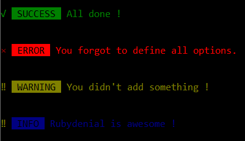

# `npx rbdnl`

>Get to know Rubydenial using your command line with Node.js

## Install

To use this CLI run the following command:

```sh
npm i rbdnl
```

## Usage

```js
const alert = require('rbdnl');

alert({type: 'success', msg: 'All done !', name: 'SUCCESS'});
// Prints: √  SUCCESS  All done !
alert();
// Prints: ×  ERROR  You forgot to define all options.
alert({type: 'warning', msg: `You didn't add something !`, name: 'WARNING'});
// Prints: ‼  WARNING  You didn't add something !
alert({type: 'info', msg: `Rubydenial is awesome !`, name: 'INFO'});
// Prints: ‼  INFO  Rubydenial is awesome !
```

## API

### alert(options)


#### > options

Type: `object` <br>
Default: `{}`

You can specify the options below.

##### > type

Type: `string` <br>
Default: `error`
 
##### > msg

Type: `string` <br>
Default: `You forgot to define all options.`

##### > name

Type: `string` <br>
Default: ``
